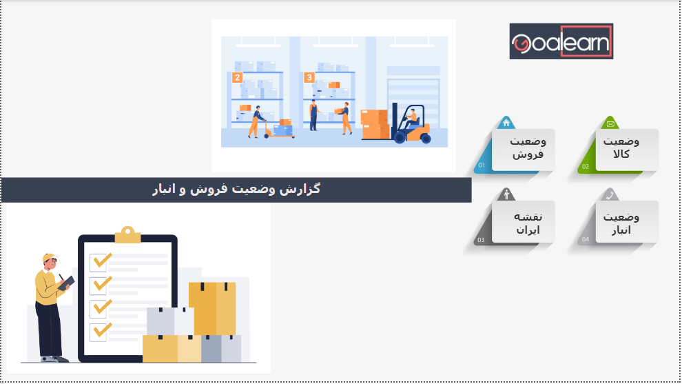

# 📊 Inventory Management Dashboard (Power BI)

## Table of Contents
- [Overview](#overview)
- [Key Features](#key-features)
  - [Main Page](#main-page)
  - [Sales Status](#sales-status)
  - [Product Status](#product-status)
  - [Iran Map](#iran-map)
  - [Warehouse Status](#warehouse-status)
- [Key Insights & Outcomes](#key-insights--outcomes)
- [Business Impact](#business-impact)
- [Repository Structure](#repository-structure)
- [Tools & Requirements](#tools--requirements)
- [How to Use](#how-to-use-quick-start)
- [Data Privacy](#data-privacy)
- [Screenshots](#screenshots)
- [Author / Contact](#author--contact)
- [Resume-friendly (1-line)](#resume-friendly-1-line)


## 🔎 Overview

**Inventory Management Dashboard (Power BI)** is an interactive dashboard designed to optimize stock management and warehouse processes.  
It provides four main pages accessible from the main navigation page, offering analytical insights such as seasonal trends, status of requested, issued, and delivered items, top-selling products, and geographical insights across provinces.  
This tool helps managers monitor inventory, track requests and deliveries, and improve warehouse efficiency.

---

## 🚀 Key Features  

### 📌 Main Page  
- Quick access and navigation to the four main sections of the dashboard  

---

### 📌 Sales Status  
- Interactive slicers by: *Product Name, Province, City, Request Date, Supply Method, Status, Approver, Invoice Number*  
- **Status Table** for displaying the current state of products  
- Summary KPI cards:  
  - Total number of **Issued Items**  
  - Total number of **Delivered Items**  
  - Total number of **Requested Items**

---

### 📌 Product Status  
- Interactive slicers by: *Product Name, Province, City, Request Date, Supply Method, Status, Approver, Invoice Number*  
- **Funnel Chart** to display and rank top-selling products  
- **Line & Stacked Column Chart** showing seasonal and yearly trends of requested, issued, and delivered items  
- **Stacked Column Chart** showing the frequency of product repetition in invoices by year and month  

---

### 📌 Iran Map  
- **Synoptic Panel**: custom map visual showing delivered items per province  
- **Clustered Column Chart**: total number of delivered items by province for regional comparison  

---

### 📌 Warehouse Status  
- Table of products **reviewed by the warehouse**, including total number of items and requests  
- Three dedicated drill-through lists for detailed tracking:  
  1. Items **restocked but not issued**  
  2. Items **issued, delivered, but not closed by the warehouse**  
  3. Items **issued but not delivered**  

---

## 📈 Key Insights & Outcomes  

### 🔹 Inventory Monitoring  
- Overview of **requested, issued, and delivered items**  
- Identification of items remaining in various states . 

### 🔹 Sales & Top Products Analysis  
- Identification of **top-selling products** using Funnel Chart  
- Analysis of **monthly and seasonal trends** of requests, issues, and deliveries  
- Frequency analysis of product appearances in invoices to identify high-demand items  

### 🔹 Geographical Distribution Analysis  
- Iran map (Synoptic Panel) showing delivered items per province  
- Identification of provinces with **highest and lowest delivery rates**  

### 🔹 Key Performance Indicators (KPIs)  
- Summary cards for total issued, delivered, and requested items  
- Interactive filters by *Product Name, Province, City, Date, Supply Method, Status, Approver, Invoice Number*  

### 🔹 Managerial Insights  
- Improved **inventory control** by identifying high-demand products  
- Better **decision-making** in product allocation by province  
- Identification of **warehouse bottlenecks** (e.g., items issued but not delivered)  

---

## 🎯 Business Impact  
This dashboard provides actionable insights for:  
- **More accurate inventory control**  
- **Improved decision-making** in product allocation and tracking  
- **Enhanced efficiency** and speed in warehouse operations  

---

## 📂 Repository Structure

```text
Inventory-Management-Dashboard/
│
├── data/
│   ├── sample_data.xlsx                  # A small subset of the original dataset
│
├── powerbi/
│   ├── Inventory-Management.pbix         # Power BI dashboard file
│
├── screenshots/
│   ├── main_page.png                     # Screenshot of dashboard in power BI
│   ├── sales_status.png                  # Screenshot of dashboard in power BI
│   ├── product_status.png                # Screenshot of dashboard in power BI
│   ├── iran_map.png                      # Screenshot of dashboard in power BI
│   ├── warehouse_status.png              # Screenshot of dashboard in power BI
│
├── README_FA.md                          # PERSIAN version of README
└── README_EN.md                          # English version of README
```

---

## 🛠️ Tools & Requirements  
- **Power BI Desktop** (to open `Inventory-Management.pbix`)  
- **Synoptic Panel** custom visual (required for map visualization)  
- **Excel / CSV** files as the data source (sample dataset provided in `data/`)  

---

## ▶️ How to Use (Quick Start)  
1. Clone or download the repository.  
```bash
   git clone https://github.com/FarnazOmidvari/inventory-management-dashboard.git
   cd inventory-management-dashboard
   ```
2. Use the sample dataset provided in the `data/` folder.  
3. Open `powerbi/Inventory-Management.pbix` in Power BI Desktop.  
4. From the main page, apply slicers and navigate to sub-pages (Sales Status, Product Status, Iran Map, Warehouse Status).  
5. If Synoptic Panel is missing, install it from *Visualizations → Get more visuals*.  

---

## 🔒 Data Privacy  
- Only limited anonymized data is included in `data/`
- Sensitive data masked or replaced
- Screenshots are illustrative only

**License:** This project is licensed under [CC BY-NC 4.0](https://creativecommons.org/licenses/by-nc/4.0/)


---

## 🖼️ Screenshots  
The `screenshots/` folder includes snapshots of key pages:  

- sales_status.png  
- product_status.png  
- iran_map.png  
- warehouse_status.png  

---

## ✍️ Author / Contact  
Developed by: **[Farnaz Omidvari]**  

📧 farnaz.omidvari1983@gmail.com

💼 https://www.linkedin.com/in/farnazomidvari/

